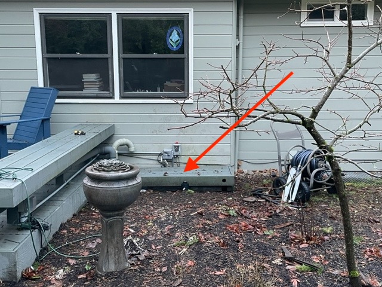
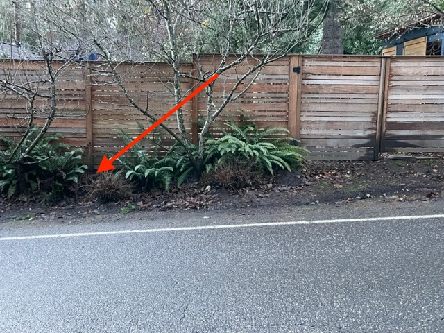
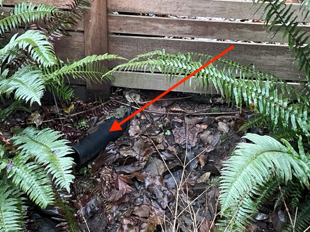
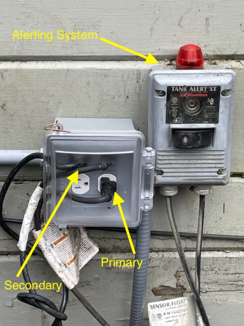

# Sump Pumps

## Overview
The sump pump system for 319 Ridge Drive exists to provide a place for rainwater to drain as well as underground water flow from springs that exist in the neighborhood.   A well (about 8' deep) has been created behind an upstairs bedroom and near the water faucets in the back as a place to catch water runoff. 
<figure>
  
  <figcaption align = "center"><b>Sump Pump Area</b>
  </figcaption>
</figure>

 

This is where the sump pumps do the task of pumping the water from the well out to Paletine Hill Rd. on the east side of the property.  

<figure>
  
  <figcaption align = "center"><b>Pump Drain from Paletine Hill Rd. (Wide View)</b>
  </figcaption>
</figure>

<figure>
  
  <figcaption align = "center"><b>Pump Drain from Paletine Hill Rd.</b>
  </figcaption>
</figure>

### Pump Manufacturing and Purchasing Details
- Zoeller Submersible Sump Pump
- 1/2 HP
- Verticle Float
- 61 GPM Flow Rate
- 15' Cord
- Link to Grainger: [Granger Sumbmersible Sump Pump](https://www.grainger.com/product/2P550)

## Failover Config
Pump failover is achieved due to the primary pump being positioned lower in the well than the secondary pump. The secondary pump sits on a cinder block about 8" higher than the primary pump.  The idea is that the secondary pump's float will only engage if there was a failure in the primary pump.  

## Electrical Config
Note that the house has a natural gas powered generator that serves as backup power to the main electrical system.  The sump pumps are designated as a critical system which is why they exist on the <em>backup</em> electrical panel. As of January 2023 the electrical outlet for the sump pumps exists on the outside wall and in a configuration where each pump is protected by its own circuit breaker in the storage room backup electrical panel.  Note that the primary pump cord should plug into the outlet on the right hand side (labled PRI) and the secondary pump should be plugged into the left hand side (labled SEC).  The alert system can plug into either side.  

<figure>
  
  <figcaption align = "center"><b>Electircal Configuration</b>
  </figcaption>
</figure>

## Installment Positioning
The primary pump is on the right hand side as you face the house, and the float should face inward towards the yard.  

The secondary pump is on the left hand side as you face the house, and the float should face outwards, towards the house.  

The reason for the specific positioning has to do with aligning the pumps to the different lengths of the connecting pumps sticking out at the top.  The primary PVC pipe is shorter than the secondary.  

<figure>
  
  <figcaption align = "center"><b>Top View</b>
  </figcaption>
</figure>

### Pump Removal
There are 2 ropes connected to each PVC pipe that are connected to the handles of the sump pumps.  In order to remove a pump you need to:

- Unplug it from the power source
- Remove the union (or fenco connection) for the unit at the top
- Pull up on the rope until the pump is at ground level.  If the pump can be rested on a cinder block and pulled up in 2 stages, that makes the process a little easier.  

## Weep Hole 
Near the bottom of the PVC pipes exists a pre-drilled weep hole about 3/8" in diameter to prevent the pipe from getting airlocked and the pump running dry.  When the pump runs it may look like leakage of some sort, but it's very much intentional.  

## Check Valves
The check valves are currently Zoeller plastic valves that work pretty well, but they can be difficult to work with because they have a 1 1/4" fitting and the PVC pipe is 1 1/2", so the Fernco fitting has to downsize by a quarter inch in order to fit correctly.  Ideally I'd like replace these with this inline check valve
[Quiet Check Valve](https://www.amazon.com/1-5-Quiet-Union-Check-Valve/dp/B0078RQ9T4/ref=sr_1_12?crid=1RPKGPY8E2FGZ&keywords=quiet+check+valve+1+1%2F2+inch&qid=1672598250&sprefix=the+quiet+check+valv%2Caps%2C144&sr=8-12) 

## Annual Maintenance
Every Summer
- Pull the pumps up and check the bottom of the pump for objects that could potentially impede the impeller.
- With the pumps removed, clean the area where the pumps reside.    

